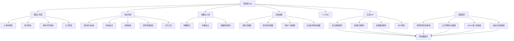

# 就业聚合 App 功能架构图

## 产品定位

该应用不是传统浏览器，而是一个面向求职场景的职位聚合与跟踪工具，核心价值包括：

1. 聚合多来源职位信息
2. 支持关键词、城市、公司等维度搜索
3. 提供官网招聘页或官网投递入口
4. 收藏企业与搜索条件
5. 对新职位、职位更新、职位下线进行提醒

## 功能模块

## 主要业务流

### 1. 搜索业务流

1. 用户输入关键词，例如 `Java`
2. 选择城市，例如 `青岛`
3. App 调用后端搜索接口
4. 后端从职位数据库中检索并返回结果
5. 前端展示职位列表，并附带来源链接和官网链接

### 2. 收藏与提醒业务流

1. 用户收藏企业或搜索条件
2. 后端保存订阅规则
3. 定时采集任务更新职位数据
4. 系统判断是否有新增、变更、下线
5. 若命中订阅规则，则生成提醒记录并推送给用户

### 3. 官网投递业务流

1. 用户查看职位详情
2. 系统优先展示官网投递链接
3. 若没有官网投递链接，则展示来源页链接和公司招聘主页
4. 用户跳转到外部网页进行投递

## 核心差异化能力

1. 多源聚合，而不是单一招聘平台依赖
2. 优先提供企业官网入口，而不是只停留在第三方页面
3. 收藏企业后能持续跟踪新岗位动态
4. 可以把职位搜索做成“订阅”而不是一次性查询

## 开发优先级建议

### 第一阶段

1. 搜索职位
2. 查看职位详情
3. 收藏企业与搜索条件
4. 新职位提醒

### 第二阶段

1. 官网投递链接完善
2. 企业画像与历史职位统计
3. 职位下线/更新差异展示
4. 简历投递记录管理
